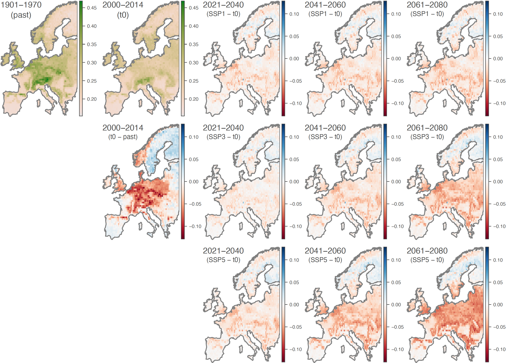

This repo gathers the input files and scripts related to our study entitled "**Projected decline in European bumblebee populations in the twenty-first century**" ([Ghisbain *et al*. 2024](https://www.nature.com/articles/s41586-023-06471-0), *Nature*). R scripts related to the analyses are all gathered within the file `Script_ENM_analyses.r`.

Abstract: Habitat degradation and climate change are globally acting as pivotal drivers of wildlife collapse, with mounting evidence that this erosion of biodiversity will accelerate in the following decades. Here, we quantify the past, present and future ecological suitability of Europe for bumblebees, a threatened group of pollinators ranked among the highest contributors to crop production value in the northern hemisphere. We demonstrate coherent declines of bumblebee populations since 1900 over most of Europe and identify future large-scale range contractions and species extirpations under all future climate and land use change scenarios. Around 38–76% of studied European bumblebee species currently classified as ‘Least Concern’ are projected to undergo losses of at least 30% of ecologically suitable territory by 2061–2080 compared to 2000–2014. All scenarios highlight that parts of Scandinavia will become potential refugia for European bumblebees; it is however uncertain whether these areas will remain clear of additional anthropogenic stressors not accounted for in present models. Our results underline the critical role of global change mitigation policies as effective levers to protect bumblebees from manmade transformation of the biosphere.

**Figure: mapped changes in ecological suitability for 46 European bumblebee species based on an observational data set of 401,046 unique georeferenced occurrence records.** We here report the ecological suitability index (ESI) defined as the local mean ecological suitability averaged over species (and thus ranging from ‘0’ to ‘1’). We report ESI estimates for the past and present-day (‘t0’, 2000-2014) projections, as well as the differences between past (1901-1970), present (‘t0’), and future (2021-2040, 2041-2040, and 2061-2080) projections. Models are based on harmonised climate, land use, and human population data obtained through the Inter-Sectoral Impact Model Intercomparison Project phase 2b.
